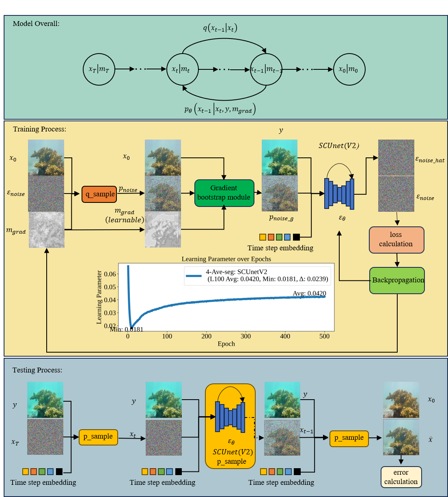

# Region Gradient-Guided Diffusion Model for Underwater Image Enhancement
https://link.springer.com/article/10.1007/s00138-024-01647-8
This is the supporting material for Region Gradient-Guided Diffusion Model for Underwater Image Enhancement, including code source code, data sets, and processed data renderings. 

